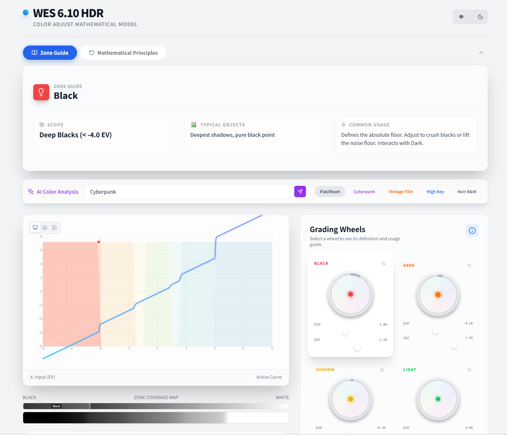

<div align="center">
  
</div>

# HDR Zone

一个基于 HDR色轮的 调色理解、参数实验和图像验证的交互式可视化工具。将可视化 Zone System、HDR 曲线、分区调色逻辑、图像预览和 AI 自动建议整合进同一套工作台，帮助用户更直观地理解“不同亮度分区到底影响什么”，以及“如何用分区逻辑而不是全局滤镜去塑造画面层次”。

## 产品定位

这个项目解决的不是“给图片套个滤镜”，而是“让用户看懂并操作 HDR Zone 调色模型”。

传统调色工具里，HDR wheels / zones 往往功能很强，但对很多用户来说抽象、难学、难验证。HDR Zone 把这套逻辑拆成可视化对象：

- 分区范围
- 软过渡 / falloff
- 亮度权重
- 曝光偏移
- 饱和度调整
- 对曲线和图像的实际影响

从产品视角看，它既是一个交互式调色控制台，也是一个带教学属性的 HDR 分区调色解释器。

## 面向的用户

- 调色学习者：理解 HDR zone 调色背后的数学逻辑
- 影像工具产品团队：验证分区式调色界面的产品形态
- 算法和图像研发团队：快速实验亮度区间与曲线的关系
- 内容创作者与后期人员：在图像上直观看到不同 zone 调整的结果

## 核心使用流程

1. 选择一个分区视角：
   - 2D 曲线
   - 3D 结构
   - 图像预览
2. 查看或选择某个 Zone
3. 调整分区范围、方向、falloff、曝光和饱和度
4. 在曲线、数学面板和示意图中理解变化逻辑
5. 切到图像模式验证这些调整在实际画面上的结果
6. 如有需要，输入目标风格，让 AI 生成建议参数
7. 保存到历史记录中继续比较不同方案

## 当前版本能力

### 1. 六区 HDR 分区调色模型

当前内置六个亮度区间：

- Black
- Dark
- Shadow
- Light
- Highlight
- Specular

每个区间都可以独立控制：

- 作用范围
- 低通 / 高通方向
- 过渡柔和度
- 曝光调整
- 饱和度调整
- 启用状态

### 2. 多视图可视化

- 2D HDR Graph：查看输入亮度到输出亮度的关系
- 3D Zone Topology：理解各 zone 的结构分布
- 图像预览模式：直接在图片上观察调色结果
- 渐变预览：快速感知区间影响范围

这让它不是只会“改参数”，而是同时能“解释参数”。

### 3. 数学解释与教学辅助

- 显示亮度与 EV 的关系
- 展示 zone 权重和 falloff 行为
- 用图形方式解释分区叠加对曲线的影响
- 提供 Guide 与 Math 两种信息视图

这部分能力让它非常适合作为教学 demo 或内部培训工具。

### 4. 图像级验证

- 支持导入图片
- 支持在图像上实时预览 zone 调整后的结果
- 支持按住按钮查看原图与处理图对比
- 支持导出当前调色结果图像

这使它从“概念解释器”扩展成了一个可验证的调色实验工具。

### 5. AI 自动调色建议

- 支持上传图片并输入目标风格
- AI 会返回基础参数与 HDR 分区建议
- 建议会映射到各个 zone 的曝光和饱和度设置
- 支持将建议结果保存到历史记录中继续调试

### 6. 历史记录与方案切换

- 支持保存当前调色方案
- 支持在历史版本间切换
- 支持删除旧版本
- 适合做风格比较和参数试验

## 产品价值

这个项目的产品价值主要在三个层面：

- 把抽象的 HDR zone 调色变成可理解、可验证、可学习的界面
- 把“曲线逻辑”和“图像结果”放到同一上下文里看
- 用 AI 把复杂参数设置前移成可用建议，降低试错门槛

相比普通滤镜工具，它更强调控制逻辑；相比纯教学页面，它又具备真实图像实验和结果导出能力。

## 适用场景

- 学习 DaVinci Resolve 风格 HDR zones 工作方式
- 团队内部讲解分区调色逻辑
- 影像产品功能原型验证
- 快速测试不同 zone 组合对图像的影响
- 用 AI 辅助生成一个可继续手调的 HDR 分区方案

## 当前技术实现

这是一个前端驱动的调色可视化原型，核心实现包括：

- React + TypeScript
- D3 图形可视化
- 基于 EV 和 zone 权重的曲线生成
- 基于像素缓冲区的图像处理
- 多语言与深浅主题切换
- Gemini 驱动的 AI 参数建议

当前图像处理是面向交互和理解设计的 CPU 级实现，重点在可解释性和体验验证，而不是高性能生产级渲染。

## 当前边界与限制

这个版本已经适合作为产品 demo 和调色教学工具，但仍有一些边界：

- 当前主要是前端原型，不是完整的专业调色软件
- 图像处理偏实验和教学用途，不对应高性能 HDR 渲染管线
- AI 建议基于通用风格描述，不等同于专业调色师的最终结果
- 当前聚焦静态图像，不直接处理视频时间轴和序列帧
- 尚未接入专业色彩管理系统、LUT 流程或项目级资产管理

## 后续演进方向

- 接入真实视频序列与时间线调色
- 支持 LUT 导出和导入
- 增加更多色彩管理与 log profile 支持
- 增强 AI 建议的可解释性和风格模板系统
- 增加更多教学模式、案例模式和对比视图
- 接入项目保存、分享和协作能力

## 本地运行

### 环境要求

- Node.js
- Gemini API Key

### 启动方式

```bash
npm install
npm run dev
```

### 构建生产包

```bash
npm run build
```

## 仓库结构

```text
HDR-Zone/
├── App.tsx                    # 主工作台、AI 建议与历史记录
├── components/
│   ├── HDRGraph.tsx           # 2D HDR 曲线图
│   ├── ZoneTopology3D.tsx     # 3D Zone 结构可视化
│   ├── ImageGrader.tsx        # 图像导入、预览与导出
│   ├── ZoneSettings.tsx       # Zone 参数控制
│   ├── GradientPreview.tsx    # 渐变预览
│   ├── MathPanel.tsx          # 数学解释面板
│   ├── ZoneGuide.tsx          # 教学与说明面板
│   └── ColorWheel.tsx         # 色彩辅助组件
├── utils/
│   ├── hdrMath.ts             # HDR 分区计算与图像处理
│   └── i18n.ts                # 多语言文案
├── types.ts                   # Zone、曲线与历史记录类型
└── assets/
    └── readme-banner.png      # README 展示图
```

## 一句话总结

HDR Zone 是一个围绕“分区式 HDR 调色”设计的可视化工作台：用图形解释逻辑，用图像验证结果，用 AI 降低上手门槛。
